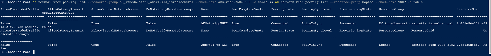

# Setup Percona Gallera Cluster On AKS Guide

## **Steps:**
 - Deploy aks cluster
 - Install the azure blob CSI on the azure-blob-storage namespace
 - Create 2 storage class one for mysql prod and the other for mysql-backup
 - Create a new namespace for managing mysql
 - Create 2 pvc's for connecting the k8s cluster to the azure blob storage
 - Create a config map of the mysql conf to apply
 - Deploy the statefulSet of mysql-prod
 - Verify mysql-prod is working and it's bound to pvc
 - Verify mysql is accessible
 - Create a configmap for mysql-backup script
 - Create a cron for mysql backup
 - Verify the mysql backup work as excepted
 - Create an internal LB to expose mysql to the azure vnets
 - Create vnet peering between the app vnet and the aks vnet where mysql stuck is running
 - Allow incoming traffic from the app vnet to the aks vnet
 - Test the connection between the app and the mysql
---

## Install Azure Blob CSI On AKS
**Guide Reference: https://learn.microsoft.com/en-us/azure/aks/csi-storage-drivers**

**1.Disable CSI storage drivers:**
  - `az aks update --name ozari-k8s --resource-group kubedb-ozari --disable-disk-driver --disable-file-driver --disable-snapshot-controller`

**2.Install aks-preview extension:**
  - `az extension add -n aks-preview`
  - If the aks-preview extension please make sure to update the extention to the latest version by running the following command:
  `az extension update --name aks-preview`

**3.Enable CSI storage drivers:**
  - `az aks update --name ozari-k8s --resource-group kubedb-ozari --enable-disk-driver --enable-file-driver --enable-blob-driver --enable-snapshot-controller`
---

## Create SC & PVC For Connecting The Cluster To The Azure Blob Storage

**1.Create a storage class in order to create dynamic PV's:**
  - `k apply -f ./conf/sc/sc-azureblob-nfs.yaml`
  - `k apply -f ./conf/sc/sc-backup-azureblob-nfs.yaml`
  - `k apply -f ./conf/sc/sc-azureblob-nfs-logs.yaml`

**2.Create a namespace for mysql and change the current namespace to the db namespace:**
  - `k create ns db`
  - `kubectl config set-context --current --namespace db`

**3.Create the PVC(persistence volume claim) for the percona cluster:**
  - `k apply -f ./conf/pvc/pvc-mysql.yaml`
  - `k apply -f ./conf/pvc/pvc-mysql-backup.yaml`
  - `k apply -f ./conf/pvc/pvc-mysql-logs.yaml`

**4.Verify the pvc is created and bound to the pv which dynamically created by the storage class:**
  - `k get pvc`
  - Wait a few minutes for the pvc to create a pv and the state will replace to bound
  

## Deploy mysql-production statefulSet app

**1.Create the configmap which holds the mysql configuration:**
  - `k apply -f ./conf/configmap/mysql-config.yaml`
  - Verify mysql configmap has been created
  

**2.Create mysql statefulSet**
  - `k apply -f ./conf/sts/mysql-sts.yaml`
  - Verify mysql production running correctly
  
  - Create a service for mysql to allow internal accessability by running the following command: `k apply -f ./conf/svc/mysql-svc.yaml`

## Deploy mysql-production backup app
**1.Create the backup script as a configmap**
  - `k apply -f ./conf/configmap/mysql-backup.yaml`
  - Verify mysql backup script has been created
  

**2.Create cronjob to backup mysql production data**
  - `
  `
  - Verify backup cronjob has been created been created
  
  - Manually trigger the job to run now for testing by running the following command: `k create job --from=cronjob/mysql-backup mysql-backup-test`
  - Wait a few minutes and verify the job has been finished successfully
  

## Create internal LB for allow access to mysql
**1.Check for free IP to use as a static IP of the LB**
  - Get the resource group of the aks nodes by running the following command: `az aks show --resource-group kubedb-ozari --name ozari-k8s --query "nodeResourceGroup" -o tsv`
  - Get the subnet address range of the aks vnet by running the following command:`az network vnet subnet list --resource-group MC_kubedb-ozari_ozari-k8s_israelcentral --vnet-name aks-vnet-26041908 -o table`

**2.Pick a free ip from the subnet and create the internal LB:**
  - Update the file ./conf/svc/mysql-internal-lb.yaml with the free IP
  
  - Create the LB service by running the following command: `k apply -f ./conf/svc/mysql-internal-lb.yaml`
  - Wait a few minutes and verify the LB has been created successfully
  

## Setup vnet peering between the app vnet to the aks vnet

**1.List all the vnets in all resource groups**
 - Open powershell on the azure portal and run the following: `az network vnet list --query "[].{Name:name, ResourceGroup:resourceGroup}" -o table`
 

**2.Find the ID of the vnets to peer:**
  - We are going to peer the vmnet named 'aks-vnet-26041908' to the vnet named 'VNET'
  - Open powershell on the azure portal and run the following in order to find the ID of the vnet named 'VNET': `az network vnet show --name VNET --resource-group Sophos --query "id" -o tsv`
  - Open powershell on the azure portal and run the following in order to find the ID of the vnet named 'aks-vnet-26041908': `az network vnet show --name aks-vnet-26041908 --resource-group MC_kubedb-ozari_ozari-k8s_israelcentral --query "id" -o tsv`
  

**2.Peer the vnets:**
  - Peer the aks vnet with the sophos vnet by running the following command: `az network vnet peering create --name AKS-to-AppVNET --resource-group MC_kubedb-ozari_ozari-k8s_israelcentral --vnet-name aks-vnet-26041908 --remote-vnet "/subscriptions/70a6f5d0-9f63-4b50-ae2c-7c901be66d0f/resourceGroups/Sophos/providers/Microsoft.Network/virtualNetworks/VNET" --allow-vnet-access`
  

  - Peer the sophos vnet with the aks vnet by running the following command: `az network vnet peering create --name AppVNET-to-AKS --resource-group Sophos --vnet-name VNET --remote-vnet "/subscriptions/70a6f5d0-9f63-4b50-ae2c-7c901be66d0f/resourceGroups/MC_kubedb-ozari_ozari-k8s_israelcentral/providers/Microsoft.Network/virtualNetworks/aks-vnet-26041908" --allow-vnet-access`
  

  - Check if the peering is successfully created by running the following command: `az network vnet peering list --resource-group MC_kubedb-ozari_ozari-k8s_israelcentral --vnet-name aks-vnet-26041908 -o table && az network vnet peering list --resource-group Sophos --vnet-name VNET -o table`
  

**3.Allow traffic to mysql from the app vnet:**
  - List all the vnets by running the following command: `az network nsg list --query "[].{Name:name, ResourceGroup:resourceGroup}" -o table`
  

  - Check whats are the subnets range on the app vnet by running the following command: `az network vnet subnet list --resource-group Sophos --vnet-name VNET -o table`
  

  - Allow MySQL traffic from peered vnet by running the following command: `az network nsg rule create --resource-group MC_kubedb-ozari_ozari-k8s_israelcentral --nsg-name aks-agentpool-26041908-nsg --name AllowMySQLFromPeeredVNET --priority 100 --direction Inbound --access Allow --protocol Tcp --destination-port-ranges 3306 --source-address-prefixes 172.16.1.0/24 172.16.0.0/24 172.16.100.0/24 172.16.2.0/26`
  

  - Verify the rule has been created successfully on the aks NSG by running the following command: `az network nsg rule list --resource-group MC_kubedb-ozari_ozari-k8s_israelcentral --nsg-name aks-agentpool-26041908-nsg -o table`
  

  - Test the connection from the app vnet to the aks vnet

